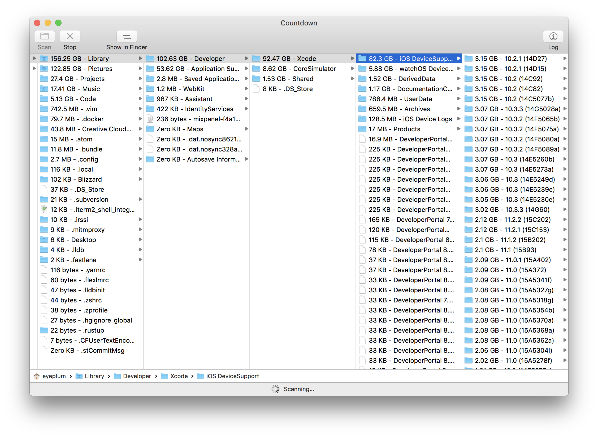

# Countdown

A friendly disk usage counter for macOS

## Why Countdown

Sometimes our Macs just went out of disk space, and we don't know why.

Sometimes after a restart, the problem went away, but a few days later, it comes again.

Finding out which files are occupying our disk space is obscure and time consuming, thus we hope `Countdown` will help you a bit on that task.

### Sandboxed

`Countdown` is sandbox enabled and only asks for read-only permission for user selected files.

This can make sure no matter where it scans, it does absolutely no harm.

## System Requirements

- Tested on macOS 10.13
- Should work on macOS 10.10 and later

Download pre-built binaries [here](https://github.com/Codezerker/Countdown/releases).
